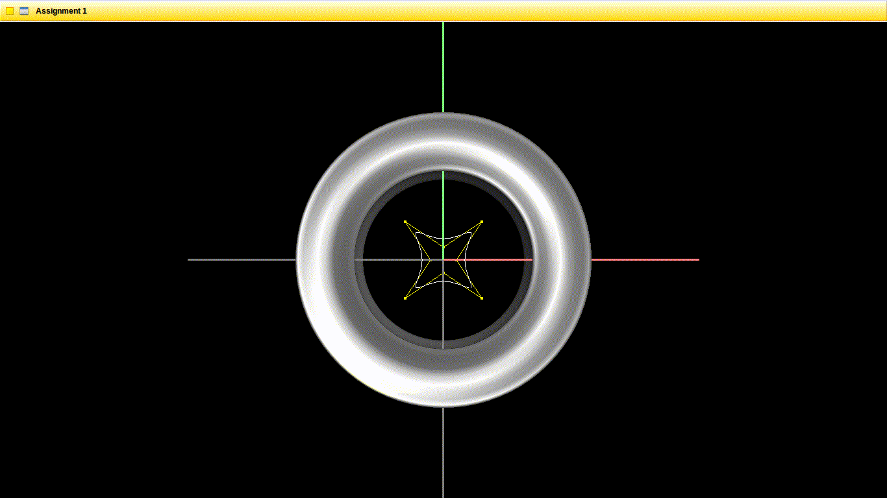

# Assignment 1

## Primary challenges
This assignment primarily consists of learning how to deal with Curves and Splines, how to compose them, how to change basis and other principal algorithms. This assignment also is the first time we deal with the provided vecmath library, for taking care of the mathematics, instead of the most common glm.

## Assignment solution running

